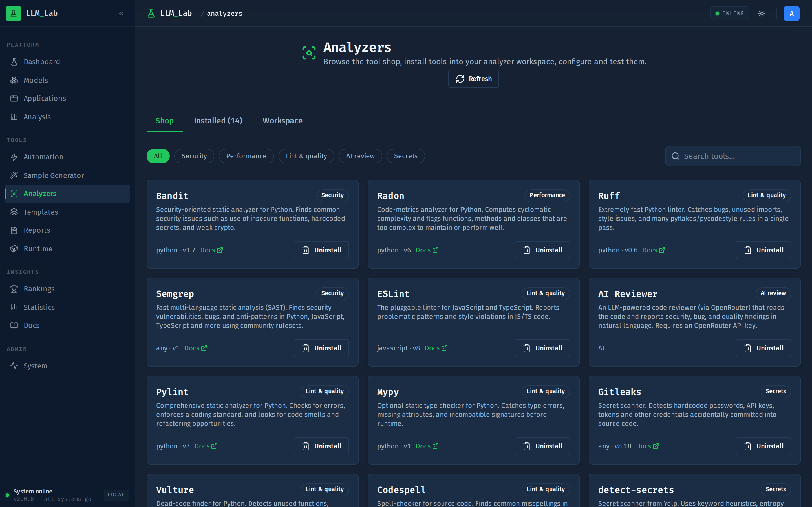
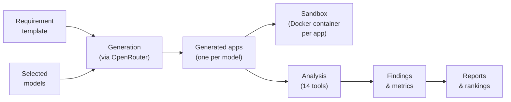

# LLM Eval Lab

Generate applications with LLMs, run them in sandboxes, and benchmark the
code they write.

[](https://github.com/GrabowMar/AutoLLM_Code_Analyzer_rework/actions/workflows/ci.yml)
[](https://github.com/GrabowMar/AutoLLM_Code_Analyzer_rework/actions/workflows/codeql.yml)
[](https://github.com/GrabowMar/AutoLLM_Code_Analyzer_rework/actions/workflows/gitleaks.yml)
[](https://github.com/GrabowMar/AutoLLM_Code_Analyzer_rework/actions/workflows/trivy.yml)
[](LICENSE)



LLM Eval Lab answers a simple question: *which model writes the best code
for a given task?* You pick a requirement template and a set of models from
[OpenRouter][openrouter], the platform generates a complete application per
model, runs each one in an isolated Docker container, and puts the code
through a battery of static-analysis and security tools. The results feed
reports and rankings, so model comparisons rest on measured findings rather
than gut feeling.

It started as a master's-thesis project and is maintained by a single
developer, so expect sharp edges — issues and PRs are welcome.
Built with Django 6, SvelteKit 2, PostgreSQL, Redis, and Celery, all
running in Docker.

## How it works



1. **Template** — a requirement template describes the application to
   build ([spec](docs/TEMPLATE_SPECIFICATION.md)); you pick one and select
   the models to compare.
2. **Generation** — Celery workers prompt each model through OpenRouter
   and collect one complete, runnable application per model.
3. **Sandbox** — each generated app runs in its own Docker container with
   subdomain routing, so you can click through it live.
4. **Analysis** — an analysis profile runs a selection of 14 tools against
   the code: ruff, bandit, semgrep, eslint, mypy, pylint, gitleaks,
   detect-secrets, hadolint, codespell, vulture, radon, jscpd, and an LLM
   code reviewer. Finding-shaped tools report issues; metric-shaped tools
   (radon, jscpd) report measurements.
5. **Reports & rankings** — findings and metrics aggregate into
   comparative reports, statistics, and per-model rankings.

The whole loop runs interactively from the UI, or unattended as an
[automation pipeline][pipelines-doc] built in a visual node-based editor.
Multi-user support (email login, optional MFA, per-user OpenRouter keys,
API tokens) makes it usable as a shared instance.

## Getting started

### Prerequisites

- Docker with the Compose plugin
- [`just`](https://github.com/casey/just) — command runner
- An [OpenRouter API key](https://openrouter.ai/keys) (needed for
  generation; browsing works without one)

### Install

```bash
git clone https://github.com/GrabowMar/AutoLLM_Code_Analyzer_rework.git
cd AutoLLM_Code_Analyzer_rework
just bootstrap        # create local .env files with random secrets
just up               # build and start the stack
just manage migrate
just manage createsuperuser
```

Open <http://localhost:8000> and log in. Add your OpenRouter key in the
UI (per user), or set `OPENROUTER_API_KEY` in `.envs/.local/.django` as a
global fallback.

Useful local endpoints:

| URL                              | What                      |
| -------------------------------- | ------------------------- |
| <http://localhost:8000>          | Frontend                  |
| <http://localhost:8001/admin/>   | Django admin              |
| <http://localhost:8001/api/docs> | API docs (staff only)     |
| <http://localhost:8025>          | Mailpit (captured emails) |

Prefer developing inside the containers? See
[docs/dev-containers.md](docs/dev-containers.md) for the VS Code setup.

### Deploy to a server

One command on any Docker host:

```bash
bash <(curl -fsSL https://raw.githubusercontent.com/GrabowMar/AutoLLM_Code_Analyzer_rework/main/scripts/deploy.sh)
```

The script clones the repo, generates env files, starts the stack, runs
migrations, and configures Caddy or nginx for your domain. Options are
documented in the script header; production proper uses
`docker-compose.production.yml` (Traefik, Nginx, Gunicorn).

## Usage

The typical loop:

1. **Pick or write a template** under *Sample generator → Templates*
2. **Generate** — select models, generate one app per model
3. **Analyze** — run an analysis profile against the generated apps
4. **Compare** — open *Reports* and *Rankings* to see how the models did

Repetitive experiments can be scripted as
[automation pipelines][pipelines-doc] instead of clicking through the steps.

## Development

```bash
just up / just down    # start / stop the stack
just logs              # tail container logs
just test              # backend tests (pytest in Docker, same as CI)
just manage <cmd>      # any manage.py command
just build             # rebuild images
just prune             # remove containers + volumes
```

Linting and type checks:

```bash
uv run pre-commit run --all-files    # ruff, djlint, prettier, and friends
uv run mypy backend
cd frontend && npm run check         # svelte-check
```

## Project structure

```
backend/     Django apps, one per domain (generation, analysis, automation,
             reports, rankings, runtime, users, ...)
config/      Settings, root URLconf, Celery app, API root
frontend/    SvelteKit app (routes, components, API client)
compose/     Dockerfiles for local and production targets
scripts/     bootstrap.py (env files), deploy.sh (server install)
docs/        Deeper documentation — start at docs/README.md
```

Secrets live in `.envs/` — only `*.example` templates are committed;
`just bootstrap` creates the real files.

## Contributing

Bug reports, ideas, and PRs are welcome — see
[CONTRIBUTING.md](CONTRIBUTING.md) for the workflow. For security
vulnerabilities, follow [SECURITY.md](SECURITY.md) instead of opening a
public issue.

## License

Distributed under the MIT License — see [LICENSE](LICENSE).

## Contact

Marcin Grabowski — [@GrabowMar](https://github.com/GrabowMar)

## Acknowledgments

- [cookiecutter-django](https://github.com/cookiecutter/cookiecutter-django)
  for the project skeleton
- [shadcn-svelte](https://shadcn-svelte.com/) / bits-ui for UI components
- [OpenRouter][openrouter] for unified model access

[openrouter]: https://openrouter.ai
[pipelines-doc]: docs/AUTOMATION_WORKFLOWS.md
