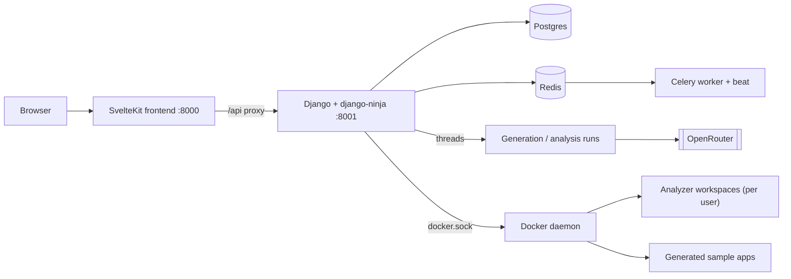

# Architecture

How the pieces fit together: the Django API, the SvelteKit frontend, the Docker surfaces for untrusted code, and where each kind of work runs.

## System overview

The browser only ever talks to the SvelteKit server, which proxies `/api` to Django. Django owns all state (Postgres) and publishes progress events to Redis, which the frontend consumes over an SSE stream.

## Backend apps

Fifteen Django apps under `backend/`, one responsibility each:

| App | Role |
| --- | --- |
| `users`, `tokens`, `credentials` | Accounts (allauth headless, MFA), Bearer API tokens, encrypted provider keys |
| `llm_models` | Model catalog synced from OpenRouter |
| `generation` | Generation jobs and templates — see [Generation process](/docs/GENERATION_PROCESS) |
| `analysis` | Tool catalog, analyzer workspaces, runs, findings — see [Analysis pipeline](/docs/ANALYSIS_PIPELINE) |
| `statistics`, `rankings`, `reports` | Aggregations, model scoring/benchmarks, saved reports (`rpt_` public IDs) |
| `runtime` | Runs generated apps as Docker containers; routing and proxying |
| `realtime` | SSE event stream backed by Redis pub/sub |
| `export` | CSV / JSON / SARIF downloads |
| `automation` | Pipelines, batches, cron schedules |
| `docs`, `system` | This docs viewer; staff-only system snapshots |

## Request path and auth

The REST API is a single django-ninja `NinjaAPI` mounted at `/api` (`config/api.py`), with two interchangeable auth schemes: Bearer API tokens (`backend/tokens/auth.py`) and Django session cookies. The interactive OpenAPI UI at `/api/docs` is staff-only. One endpoint lives outside ninja because it streams: `GET /api/realtime/stream` (`config/urls.py`).

Views raise HTTP errors directly; services raise `backend.common.exceptions.*`, mapped to `{"detail": ...}` responses by the exception handler in `config/api.py`.

## Execution model: threads vs Celery

The load-bearing nuance of this codebase:

- **Interactive generation and analysis runs execute on daemon threads inside the django process** (`backend/common/threading.dispatch_in_thread`, used by `generation/services/dispatcher.py` and `analysis/services/runner.py`). The stack works with no Celery worker at all — but in-flight runs die if the django container restarts.
- **Celery handles automation**: pipeline runs (`run_pipeline_task`), batches, and the schedule tick (`run_scheduler_tick` via beat). If the broker is unreachable, automation falls back to a daemon thread too.

Details in [Background services](/docs/BACKGROUND_SERVICES).

## Docker surfaces

Django mounts `/var/run/docker.sock` and drives two kinds of sibling containers:

1. **Analyzer workspaces** — one long-lived, hardened container per user, built from the `backend/analyzer-base:latest` image (`backend/analysis/images/analyzer-base`). Analysis tools are installed into it once and reused across runs; each run's code is copied into `/work` after wiping the previous run's files.
2. **Generated sample apps** — each completed generation job can be built and started as its own container by the `runtime` app. Locally they're reached through the in-app path proxy (`/apps/<name>/`); in production `AppSubdomainProxyMiddleware` serves each app at `<container>.<APPS_DOMAIN>` behind Traefik — see [Deployment guide](/docs/deployment-guide).

## Data flow

A full experiment is: generate an app per model → run it → analyze it → compare.

1. A generation job calls OpenRouter with the job owner's key and writes structured code artifacts.
2. An analysis run executes the selected tools against that code and persists normalized `Finding` rows plus per-tool metrics.
3. Statistics, rankings, and reports aggregate over findings and jobs — counting only the latest completed run per job — and everything is downloadable via the export endpoints ([API reference](/docs/api-reference)).

## Scoring: measurement vs. decision aid

Rankings keep two kinds of numbers strictly apart (`backend/rankings/services/`):

- **Empirical quality (measured).** Severity-weighted findings from the deterministic
  container tools only, normalized per KLOC of generated code and blended with the
  smoke pass rate. Findings from AI-kind tools (`AnalyzerTool.kind == "ai"`, e.g. the
  LLM reviewer) are opinions with their own run-to-run variance, so they never enter
  this score — they are reported separately as `ai_findings`. Each score carries
  `n_trials` and between-trial spread (stdev of per-job findings density and smoke
  pass rate); a single completed trial is an anecdote, not a result.
- **MSS (decision aid).** An opinionated composite of model metadata — adoption,
  public benchmarks, cost, accessibility — with asserted weights. Useful for picking
  a model, but not a measurement made here. **Composite** blends MSS with empirical
  quality when local measurements exist.

Because the baseline severity weights (`SEVERITY_WEIGHTS` in
`rankings/services/constants.py`) are asserted rather than derived, the platform also
reports a sensitivity analysis: the empirical ranking is recomputed under the
alternative schemes in `SEVERITY_WEIGHT_SCHEMES` and compared with Kendall's tau plus
the list of rank swaps (`GET /api/rankings/sensitivity/`, also embedded in
template-comparison and comprehensive reports). Tau near 1.0 across schemes means the
ordering does not hinge on the particular weight choice.

The "smoke pass rate" is exactly that: `/api/health` plus the template's declared GET
endpoints. It shows a generated app starts and responds, not that it is functionally
correct. The statistics page's model comparison delegates to the same rankings
aggregation, so the two pages cannot disagree.
