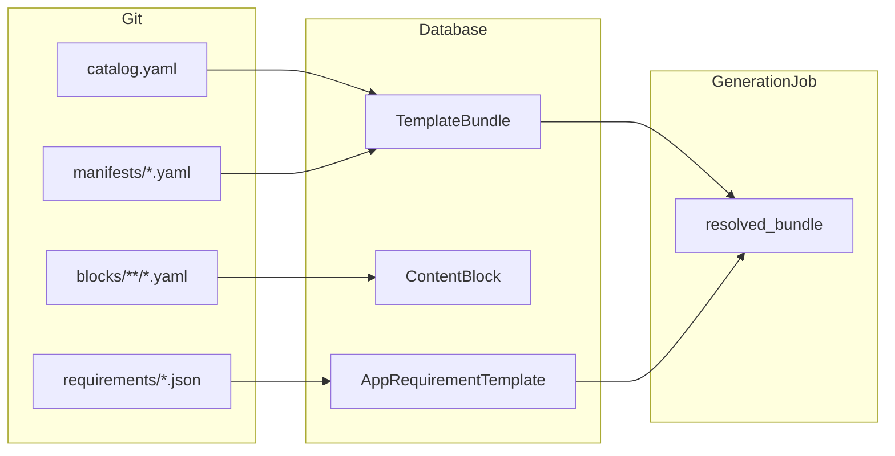

# Template Specification

> **Summary**: Requirement JSON, composable content blocks, template bundles, and frozen job snapshots for reproducible scaffolding generation.
> **Key files**: `llm_lab/generation/data/requirements/`, `llm_lab/generation/data/blocks/`, `llm_lab/generation/services/bundle_resolver.py`
> **See also**: [Generation Process](GENERATION_PROCESS.md)

## Architecture



1. **App requirement** — full app spec (features, API, data model) from JSON.
2. **Content blocks** — composable prompt fragments (stage, tone, rules).
3. **Template bundle** — ordered block list + default scaffolding slug.
4. **Resolved bundle** — immutable snapshot on `GenerationJob` at create (prompts, blocks, seed, LLM config).

## App requirement JSON

Path: `llm_lab/generation/data/requirements/{slug}.json`

| Field | Required | Description |
|-------|----------|-------------|
| `slug` | yes | Unique identifier |
| `name` | yes | Display name |
| `category` | yes | Study category |
| `description` | yes | One-line summary |
| `backend_requirements` | yes | List of backend bullets |
| `frontend_requirements` | yes | List of frontend bullets |
| `api_endpoints` | recommended | Structured endpoint specs |
| `data_model` | optional | Model schema hints |
| `admin_requirements` | optional | Admin UI bullets |
| `admin_api_endpoints` | optional | Admin API specs (rendered into prompts) |

Health checks belong in `api_endpoints`, not a separate `control_endpoints` field.

## Per-app manifests (pilot decomposition)

Path: `llm_lab/generation/data/requirements/manifests/{app_slug}.yaml`

```yaml
app_slug: content_recipe_list
bundle_slug: app-content-recipe-list
name: Recipe Book (minimal bundle)
base_bundle_slug: system-scaffolding-standard
extra_block_refs:
  - type: prompt_tone
    slug: tone-minimal
    version: 1
```

Seeding merges `base_bundle_slug` block refs with `extra_block_refs` into a `TemplateBundle` row.

Convention: `app-{slug-with-dashes}` (e.g. `content_recipe_list` → `app-content-recipe-list`).

When creating scaffolding jobs without an explicit bundle, the API picks the per-app bundle if it exists, otherwise `system-scaffolding-standard`.

## Content blocks

Path: `llm_lab/generation/data/blocks/{type}/{slug}.yaml`

| `block_type` | Purpose |
|--------------|---------|
| `prompt_stage` | Backend/frontend system or user Jinja (`metadata.stage`, `metadata.role`) |
| `prompt_tone` | Scope / line-count guidance |
| `prompt_rules` | Hard Flask/runtime rules |
| `scaffold_hint` | Stack-specific hints (future) |
| `validation` | Post-gen checks (future) |
| `eval_rubric` | Research metrics (future) |

System blocks (`is_system=true`) are seeded from git; users can add private blocks via `POST /generation/blocks/`.

## Template bundles

Defined in `llm_lab/generation/data/blocks/catalog.yaml` and per-app manifests.

Default research bundle: **`system-scaffolding-standard`** (v2 stage prompts + `tone-standard` + `rules-flask-global`).

API:

- `GET /generation/bundles/` — list bundles (system + yours)
- `GET /generation/blocks/catalog/` — system block catalog
- `GET /generation/bundles/{slug}/preview/` — assembled prompt template sizes

## Job snapshot (`resolved_bundle`)

Created by `apply_snapshot_to_job()` when scaffolding jobs are queued.

Includes:

- `bundle_schema_version`, `bundle_slug`, `scaffolding_slug`
- `seed`, `llm` (model, temperature, max_tokens)
- `blocks[]` with `resolved_content`
- `app_requirement` (full copy)
- `prompt_templates` (raw assembled Jinja)
- `prompts.backend` (pre-rendered at create)
- `prompt_hash` (reproducibility fingerprint)

Frontend generation uses the snapshot; legacy jobs with empty `resolved_bundle` fall back to DB `PromptTemplate` rows.

## Experiment export

`GET /generation/jobs/{id}/export/` returns:

- `experiment` — summary (bundle slug, seed, prompt hash, block count)
- `resolved_bundle` — full snapshot
- `job`, `artifacts`, `copilot_iterations`

## Scaffolding stacks

Registry: `llm_lab/runtime/scaffolding/manifest.json`

| Slug | Description |
|------|-------------|
| `flask-react` | Flask 3 + React 18 (default) |
| `generic-python` | API-only Flask |
| `fastapi-vue` | FastAPI + Vue 3 (experimental) |

## Seeding

```bash
python manage.py seed_generation_templates
```

Imports requirements, blocks, catalog bundles, app manifests, and legacy `PromptTemplate` rows.
